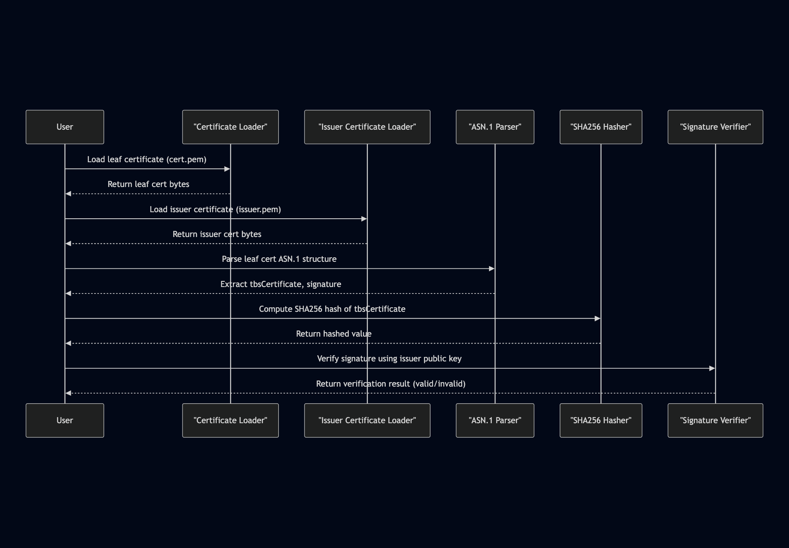

# digital-signatures-in-go



---

*vibe-coded.*

Non-production exploration of digital signatures. Digital signatures are used to ensure authenticity, integrity, and non-repudiation in digital communications and data.

---

**Example Usage:**

Example with certificates downloaded from google.com

1. Run: `cp google-certs/* .`
2. Run: `go install` && `go run .`

expected output: 
```
Verifying cert for subject: *.google.com
✅ Signature is valid (verified against issuer's public key)
```

---

> [!NOTE]
> While names issuer.crt and leaf.crt are used in script, leaf.crt might be better named signed.crt. See [RFC 7468](https://www.rfc-editor.org/rfc/rfc7468.html) for why .crt over .pem file extensions.


